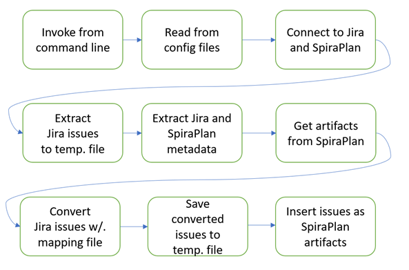

# Advanced Jira to Spira Migration Tool (spira-jira-migration-advanced)
## Introduction
Jira Server/DataCenter and Spira are both software tools that help teams plan, manage, and deliver projects. Jira is a product of Atlassian, and Spira is a product of Inflectra. This tool migrates and converts Jira issues to Spira artifacts along with metadata and attachments. 

This tool serves as an alternative to Spira's native migration app, Jira Importer, but is designed to offer more flexibility and control over the migration process because it allows you to customize the mapping between the two systems. It has advanced configuration options for mapping fields, products, and programs between the two applications.

Please note that you will need to do some manual configuration in Spira before running the migration. For example, create custom fields, set workflows, and create users.

This readme has instructions to configure and run the migration tool. It operates via the command line. The intended user is a developer, a DevOps engineer, or technical system administrator. However, the user guide could also be of interest to any stakeholder of the migration process and who wants to get a deeper understanding of how the tool is built and how it works. For information on how to navigate and operate in Spira or Jira, please use their respective instruction manual. 

This tool was originally developed by Tietoevry AB for Saab AB. It has been designed for general use and is available under the MIT license (first released in late 2023).

For professional support, please contact Inflectra, who can provide contacts within Tietoevry that can assist with your use case.

### Quick Start
- Clone this repo locally
- Make sure your machine is using at least Python 3.10
- Navigate to the local repo’s folder from the command line
- Run the following command `pip install -r requirements.txt` to install the required Python packages
- Make a copy of the `.env.template` file called `.env` in the root folder of the repo, and fill in all the relevant connection information for Jira and Spira
- Open the `mapping_template.yaml` example configuration file and edit it as needed
- Refer to the rest of this readme to learn which commands to execute to achieve your goals
- Given the complexity of detailed data migration, you will probably need to iterate on the configuration and migration sequence. This tool is comprised of small commands you can stack together in the order you need to achieve these goals.

## Conceptual Overview
The tool is an independent Python program that interacts with Jira and Spira instances through their respective REST APIs. It operates from the command line and uses a configurable mapping file, that defines a set of rules for the data transfer between the two systems.


### Data Flow
The migration starts with the user entering a given command. An example of the data flow when migrating issues is visualized in the following diagram. 




## What does the migration tool do?
This script-based tool can at the **product** level:

- Import Releases and put them in a hierarchy
- Import Requirements and put them in a hierarchy
- Import Components
- Import Incidents
- Import Tasks
- Import Comments
- Set the correct statuses and priorities of artifacts in Spira, as defined in the mapping template
- Set the correct releases for artifacts
- Set Artifact associations (within the same spira product)
- Import Documents to separate folder and set artifact association (within the same spira product)
- Set document-artifact association (within the same spira product) in separate command.
- Map standard and custom properties from Jira
- Statuses: sets the correct status of artifacts in Spira, defined in the mapping template in the script
- Priorities: sets the correct status of artifacts in Spira, defined in the mapping template in the script
- Clear all artifacts except documents in one command
- Clear all documents in one command

For **product templates** it can:

- Import Custom Lists

For **programs** it can:

- Import Program Milestones
- Import Capabilities and map them to Program Milestones
- Map product level Releases to Program Milestones
- Map product level Requirements to Capabilities
- Clear Program Milestones and Capabilities

At the **system** level it can:

- Import system level custom lists

### Future expected enhancements
- Pre-flight checks to prevent errors during migration
- Migration crash resume feature
- Migration verbose and more useful progress logging
- More usage examples

## Getting Started
- **Prerequisites**: 

    - Python 3.10+
    - Python's pip package manager
    - The tool is designed to run in both Linux and MacOS environments. For Windows, a WSL Linux environment is suggested to make it work
    - Ensure there is sufficient disk space for data storage and temporary files. Generated during the migration
    - Ensure the system has internet access to both the Jira and Spira instance and that firewall rules allow outbound connections
    - Ensure the users you configure for Jira and Spira have sufficient access. For Jira, read access is required, for Spira we recommend making the user a system administrator
    - The tool requires an IDE or a terminal window


- **Install dependencies**: The tool's dependencies are stored in the requirement.txt file. To install these dependencies run: `pip install -r requirements.txt`
- **Update dependencies**: If you have added or updated a python package, run `redo pip freeze } requirements.txt` to overwrite the old requirements.txt file
- **Autoformat**: To auto format your code on save go to VSCode settings } TextEditor } Formatting and tick the Format-on-Save box
- **Connection information**: Copy the `.env.template` to a new file called `.env` in the root folder of the project, and fill in all the relevant connection information for Jira and Spira
- **Configuration**: Edit the `mapping_template.yaml` file to meet your needs
- **Migration**: Run the correct commands to carry out the migration (see below)

## Before migration
### Prepare Spira
- Create all users (the tool will match users with Jira using the email address)
- Create a product
- Create a program
- Configure the product template:

    - Requirement importances, statuses, types, and custom properties
    - Incident priority, statuses, types, and custom properties
    - Task priority, types, and custom properties
    - Document custom properties
    - For each artifact, create a dedicated custom property of type text called exactly "Jira ID"

- Configure the system level artifact fields:

    - Capability statuses, priorities, types, and custom properties
    - Program Milestone custom properties
    - For each artifact, create a dedicated custom property of type text called exactly "Jira ID"

### Prepare the migration tool
Check that there is a .env file in the project root folder with all fields filled in

Update the mapping_template.yaml file. There are notes about how to do this in the example yaml file. The mapping file is used to configure mappings between Jira issues and Spira. In general, each Jira value is a key (left) and each Spira value is the mapped value for the key (right). The mapping file is used for the following Spira artifacts and fields:

- Priorities for capabilities, requirement, incidents, and tasks
- Statuses for capabilities, program milestones, requirement, releases incidents, and tasks
- Types for capabilities, requirements, incidents, and tasks
- Custom properties for capabilities, requirements, incidents, and tasks
- The hierarchical order of capabilities
- The order to add artifacts from Jira to Spira in (to ensure dependencies are taking account of)


## Migration commands
A program or product identifier can either be the ID (integer) or the full case sensitive name of the program or product (for example "12"). For Jira projects use the project token (for example "PROJ1").

The tool uses a large selection of commands to give you fine grained control about what to import when. These are explained below.

All commands start with `python main.py` or `python3 main.py`. This is necessary for the operating system to use the python interpreter and the main.py argument specifies that the tool should start executing from the main.py file. 

You will very likely run multiple commands in series to migrate the data required in the right order, given dependencies.

### General Arguments
- **jql**: stands for Jira Query Language and is a flexible way to search and filter for jira issues. Example: "issue = PROJ-12" to search for a specific issue or "issuetype = Epic" to receive all Epics
- **list of projects**: specifies the Jira projects you want to migrate data from. The list should be a space-separated sequence of project names without quotation marks. Example: "PROJ1 PROJ2 PROJ3"
- **list of template ids**: specifies Spira product templates you want to migrate relevant Jira data into. The list should be a space-separated sequence of template names or ids without quotation marks. Example: "12 13 My_spiraplan_project_template" 
- **program identifier**: the Spira program name or only program id. Example: "My_spiraplan_program" or "4"
- **project identifier**: the Spira project name or only project id. Example: "My_spiraplan_project" or "25"

### Optional flags
Below are a list of optional flags that you can append to most commands. See the specific command for help with relevant flags:

- `-m {filename}` or `--mapping {filename}`: specify a file other than the default from which to take the mapping config
- `-jo {filename}` or `--jira-to-json-output {filename}`: specify a file path other than the default to where the extracted json is going to go
- `-system` or `--system-level`: Boolean flag, set when migrating system level custom lists. It is only needed once. Will override template flag
- `-template` or `--spira-templates`: Flag set when migrating custom lists at the product template level, specifies a list of template name or id
- `-nossl` or `--skip-ssl-check`: Boolean flag, specify if we want to disable the ssl check. Disabling SSL opens the script for man-in-the-middle-attacks but might be required if there is no valid HTTPS cert available

### Artifact Migration
To **migrate versions to program milestones**. It is important to execute this command before migrating issues to capabilities, because when creating a capability, it sets the association to a program milestone. 

```shell
python3 main.py migrate_milestones {program identifier} {jql} {list of jira projects without commas, e.g. PROJ1 PROJ2 PROJ3 } -nossl
```

---

To **migrate capabilities**. If the jql is set to empty, i.e., "", it will take all Epics and Initiatives in Jira and migrate them to capabilities. This command needs to be run before migrating product level issues. This is because requirements at the product level can only be connected to a capability on migration/creation if the capabilities already exist. 

```shell
python3 main.py migrate_capabilities {program identifier} {jql} -nossl
```

---

To **migrate components**. This should normally be run before migrating issues into a product, so that issues can be associated to a component when they are created.

```shell
python3 main.py migrate_components {product identifier} {list of jira projects without commas} -nossl
```

---

To **migrate versions to releases**. In Jira an issue can have a list of versions, however in Spira artifacts can generally only have one. The tool will choose the first one in the list when linking artifacts to releases. This command should be run before migrating product level artifacts, so that these artifacts can be linked to the right release.


```shell
python3 main.py migrate_releases {product identifier} {list of jira projects without commas} -nossl
```

---

To **migrate issues to requirements, incidents, and tasks**. This command migrates all issues in the set jql and inserts them into Spira with the correct artifact type. The command only handles one product to migrate into at a time. It is important to insert the artifacts in Spira in the correct order, due to the dependencies between some of them. For example, a task artifact can be connected to a requirement artifact, therefore requirements should be inserted before tasks. If you migrate all artifacts in a single operation, the migrating tool will automatically migrate them in the correct order. However, if you decide to divide this migration into several jql-queries, make sure that requirements are moved first and tasks last. It is important that this command is run after migrating capabilities, releases, and components. This is because of their internal relations. The order can be customized in the mapping file under the “artifact_type_order” key.

```shell
python3 main.py migrate_issues {product identifier} {jql} -nossl
```

---

To **migrate issue links to artifacts associations**. This command sets the association between two artifacts. In Jira the association is named "linked to", "blocked by", etc. In Spira the association between two artifacts is different - the information about what type of association was migrated from Jira is shown in the association comment instead. This command extracts the issues and its metadata selected by the jql and uses that information to get the type of association to create in Spira. All issues must be migrated to the project before executing this command. 


```shell
python3 main.py migrate_associations {product identifier} {jql} -nossl
```

---

To **migrate issue comments to artifact comments**. This command migrates all comments associated with an issue to the mapped artifact in Spira. Not all comment features in Jira can be applied in Spira. For example, in Jira you can link to an issue in the comment, but in Spira it will be shown as the Jira id with square brackets.  All issues must be migrated to the project before executing this command. 

```shell
python3 main.py migrate_comments {product identifier} {jql} -nossl
```

---

To **migrate issue attachments to document artifact with artifact association**. Unlike Jira, where documents only exist as attachments on specific issues, Spira has a separate artifact type for documents and allows them to be linked with other artifacts through associations. This command migrates the attachments and the associations to relevant artifacts. The command works by retrieving all product artifacts from Spira and matching them with the Jira id of the migrated attachments. The association is created when the attachment is uploaded as a document artifact to Spira. All issues must be migrated to the project before executing this command.

```shell
python3 main.py migrate_documents {product identifier} {jql} -nossl
```

Add **document artifact associations** without migrating attachments. This command establishes the association between a document and the linked requirement, incident, or task by verifying a custom property labeled `Jira id`. The `Jira id` field represents the Jira issue previously linked to the document within Jira. The associations are only set within the Spira product.  This is necessary when artifacts have been cleansed and re-migrated without removing documents.

```shell
python3 main.py add_document_associations {product identifier} -nossl
```

### Custom lists
To migrate system level custom lists, run the command below. NOTE: you should run this *before* migrating program level artifacts

```shell
python3 main.py migrate_customlists {list of jira projects without commas, e.g. PROJ1 PROJ2 PROJ3} -system -nossl
```

---

To migrate product template custom lists, run the command below. NOTE: you should run this *before* migrating product level artifacts. This uses the same command as creating custom lists at the system level, but uses a different flag. It does not matter which set of custom lists you migrate first. 

```shell
python3 main.py migrate_customlists {list of jira projects without commas, e.g. PROJ1 PROJ2 PROJ3} -template {list of spira templateids or templatenames without commas, e.g. 12 13 Migration tool for Jira}  -nossl
```


### Cleaning up
To remove all documents in a product:

```shell
python3 main.py clean_product_documents {product identifier} -nossl
```

To scrub the product clean of all releases, components, requirement, incidents, and tasks

```shell
python3 main.py clean_product {product identifier} -nossl
```

To scrub the program clean of capabilities and program milestones:

```shell
python3 main.py clean_program {program identifier}  -nossl
```


## Example Migration Checklist
The example checklist below is based on the scenario of running a full migration of a Jira product to a Spira program and product. 

1.	In Spira:

    1.	Create a program
    2.	Create a product
    3.	Create all users
    4.	Create API key for a user that will be used in the migration tool and make sure it has all necessary access

2.	In Jira, check that the user that will be used in the migration tool has all necessary access
3.	Migrate custom lists both at system level
4.	Migrate custom lists at product template level
5.	In Spira: 

    1.	For program capabilities at the system level:
    
        1. Set priorities, statuses, and types
        2. Create all custom properties to migrate from Jira
        3. Create a dedicated text custom property called `Jira Id`

    2.	For requirements in the product template:
    
        1. Set importances and types
        2. Create all custom properties to migrate from Jira
        3. Create a dedicated text custom property called `Jira Id`

    3.	For incidents in the product template:
    
        1. Set priorities, statuses, and types
        2. Create all custom properties to migrate from Jira
        3. Create a dedicated text custom property called `Jira Id`

    4.	For tasks in the product template:
    
        1. Set priorities and types
        2. Create all custom properties to migrate from Jira
        3. Create a dedicated text custom property called `Jira Id`

    5.	For documents in the product template:
      
        1. Create all custom properties to migrate from Jira
        2. Create a dedicated text custom property called `Jira Id`

6.	In config files in migration tool:

    1.	Fill in mapping yaml-file.
    2.	Copy the “.env.template” file to a new “.env” file.
    3.	Set Jira and Spira connection data in the “.env” file.

7.	Migrate milestones
8.	Migrate capabilities
9.	Migrate releases
10.	Migrate components
11.	Migrate issues
12.	Migrate associations
13.	Migrate comments
14.	Migrate documents
